# Despliegue de un servicio de monitorización

Instalar y configurar uno de los siguientes servicios de monitorización (uno de los siguientes asignado por el profesor: Icinga, Nagios, Zabbix) en una MV con Ubuntu y monitorizar lo siguiente:
- Los recursos de hardware (CPU, RAM, disco duro) de otra máquina virtual (Windows/Linux).
- Algún servicio de red (SAMBA/SMB, FTP, SSH, HTTP, ...).
- La página web del instituto.

---

#### Para esta práctica vamos a instalar Nagios Core pero antes de eso necesitamos instalar algunos servicios: Apache, PHP , Pstgre y phpPgAdmin

**Instalamos apache**
1. Tiramos el comando siguiente para actualizar la lista de paquetes
```
~$ sudo apt update
```

2. Ahora descargamos el paquete que necesitamos, apache 2
```
~$ sudo apt install -y apache2
```

**Instalación de PHP**
1. Descargamos el paquete que necesitamos 
```
~$ sudo apt install -y libapache2-mod-php
```

**Instalamos PostgreSQL**

1. Descargamos el paquete que necesitamos
```
~$ sudo apt install -y postgresql-12
```

2. Creamos al superusuario y la base de datos de este mismo 
```
~$ sudo -u postgres createuser --interactive idp
~$ createdb idp -O idp
```

3. Creamos la contraseña de nuestro usuario

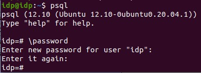

4. Activamos el uso de la contraseña editando el fichero pg_hba.conf y cambimos "peer" por "md5"
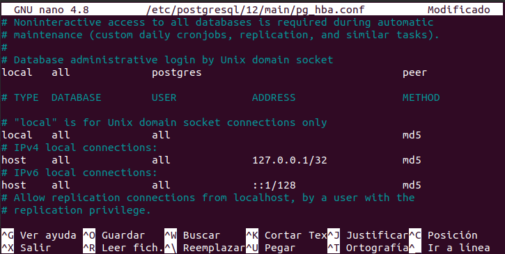

5. Recargamos la configuración 
```
~$ sudo systemctl reload postgresql
```

**Instalamos phpPgAdmin**
1. Descargamos el paquete que necesitamos
```
~$ sudo apt install -y phppgadim
```

#### Tras hacer todos estos pasos estamos lista para la empezar la instalación de nuestro sistema de monitorización “Nagios”
**(Esta parte se tiene que hacer tanto en servidor como en cliente)**

1. Ahora vamos a descargar los plugins necesarios desde este link de github
```
~$ wget -q https://github.com/nagios-plugins/nagios-plugins/releases/download/release-2.4.0/nagios-plugins-2.4.0.tar.gz
```

2. También vamos a instalar algunas dependencias necesarias para los plugins
```
~$ sudo apt install -y fping libcrypt-x509-perl libdatetime-format-dateparse-perl libdbi-dev libkrb5-dev libldap2-dev libmysqlclient-dev libnet-snmp-perl libssl-dev libtext-glob-perl libwww-perl postgresql-server-dev-12 qstat rpcbind smbclient snmp
```

3. Descomprimimos el paquete de código fuente de los plugins de Nagios y nos movemos a la carpeta que se acaba de crear
```
~$ tar xf nagios-plugins-2.4.0.tar.gz
~$ cd nagios-plugins-2.4.0/
```

4. Configuramos la compilación
```
~$ ./configure/
```

5. Compilamos
```
~$ make
```

6. Hacemos la instalación y salimos del directorio
```
~$ sudo make install
~$ cd ..
```

**Instalamos Nagios Core**
1.	Ahora vamos a descargar la versios 4.4.7 desde este link de github
```
~$ wget -q https://github.com/NagiosEnterprises/nagioscore/releases/download/nagios-4.4.7/nagios-4.4.7.tar.gz
```

2. Istalamos algunas herramientas y dependencias que vamos a necesitar
```
~$ sudo apt install -y libgd-dev libltdl-dev traceroute un
```

3. Descombpirmios el codigo y nos movemos a la carpeta que se crea
```
~$ tar xf nagios-4.4.7.tar.gz
~$ cd nagios-4.4.7/
```

4. Configuramos la compilación
```
~$ ./configure --disable-ssl
```

5. Compilamos
```
~$ make all
```

6. Instalamos el servicio con sus configuracions
```
~$ sudo make install-groups-users install install-webconf install-config install-init install-daemoninit install-commandmode
```

7. Añadimos al usuario que se acaba de crear permisos para acceder a los sevicios web y salimos del directorio
```
~$ sudo usermod -a -G nagios www-data
```

**Iniciamos el servicio Nagios**
1. Iniciamos el servicio Bagios
```
~$ sudo systemctl start nagios
```

2. Comprobamos es estado del sevicio con el siguiente comando
```
~$ systemctl status nagios
```

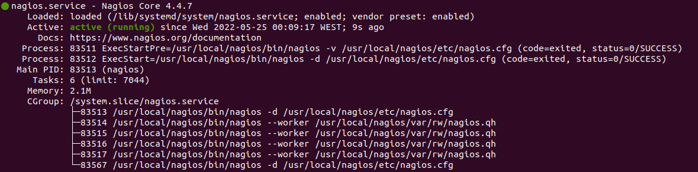

**Preparacion del servicio Web**
1. Lo primero es activar el módulo CGI de Apache, una vez iniciado terndremos que reiniciar apache para que tome efecto
```
~$ sudo a2enmod cgi
~$ sudo systemctl restart apache2
```

2. Para que Nagios funcione necesita un usuario administrado *nagiosadmin* el cual vamos a crear
```
~$ sudo htpasswd -c /usr/local/nagios/etc/htpasswd.users nagiosadmin
```

**Accedemos a Nagios**
1. Ponemos en un buscador (firefox tiene incompatibilidades) nuestra IP seguida de */nagios*

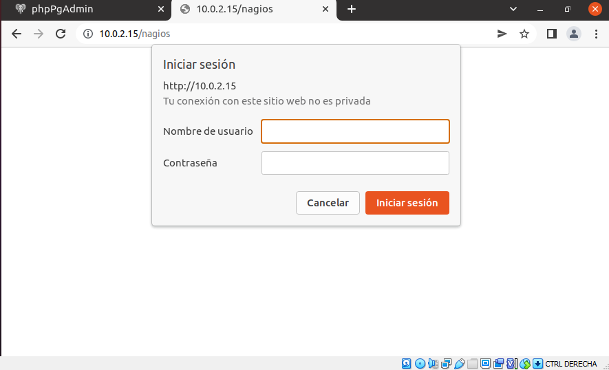
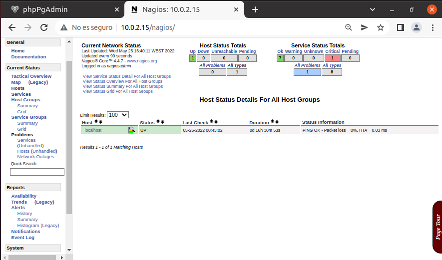

#### Ahora tendremos que descargar y configurar Nagios NRPE en tanto el servidor como en la maquina que queramos monitorizar

**Instalamos NRPE en el sevidor y el equipo que queremos monitorizar**
1. Descargamos el paquete y las dependencias
```
~$ wget -q https://github.com/NagiosEnterprises/nrpe/releases/download/nrpe-4.0.3/nrpe-4.0.3.tar.gz
~$ sudo apt install -y libwrap0-dev
```

**En el cliente**
1. Descombpirmios el codigo y nos movemos a la carpeta que se crea
```
~$ tar xf nrpe-4.0.3.tar.gz
~$ cd nrpe-4.0.3/
```

2. Configuramos
```
~$ ./configure
```

3. Compilamos
```
~$ make nrpe
```

4. Lo instalamos y salimos del directorio
```
~$ sudo make install-groups-users install-daemon install-config install-init
~$ cd ..
```

**Configuramos el servicio NRPE**
1. Editamos el fichero *nrpe.cfg* y cambiamos la linea *allowed_hosts* y añadimos la Ip del servidor
```
~$ sudo nano /usr/local/nagios/etc/nrpe.cfg
```

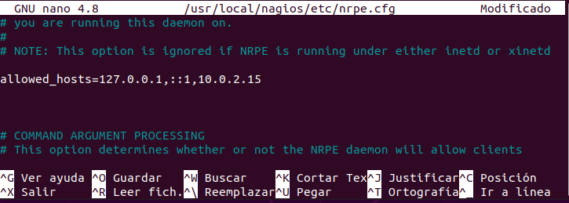

2. Ejecutamos el servicio y modificamos el firewall
```
~$ sudo systemctl start nrpe.service
~$ sudo ufw allow nrpe
```

**En el servidor**
. Descombpirmios el codigo y nos movemos a la carpeta que se crea
```
~$ tar xf nrpe-4.0.3.tar.gz
~$ cd nrpe-4.0.3/
```

2. Configuramos
```
~$ ./configure
```

3. Compilamos
```
~$ make check_nrpe
```

4. Lo instalamos y salimos del directorio
```
~$ sudo make install-groups-users install-daemon install-config install-init
~$ cd ..
```

**Configuramos el plugin NRPE**
1. Añadimos las siguientes lineas dentro del fichero *commands.cfg* para que nagios core pueda usar NRPE
```
~$ sudo nano /usr/local/nagios/etc/objects/commands.cfg
```
```
################################################################################
# Comando para usar el plugin check_nrpe
################################################################################
define command {
        command_name check_nrpe
        command_line $USER1$/check_nrpe -H $HOSTADDRESS$ -c $ARG1$
```

2. Guardamos y recargamos
```
~$ sudo systemctl reload nagios
```

#### Conectamos el servidor con la maquina que queremos monitorizar
1. Creamos un fichero para guardar la configuracion de todas las maquinas remotas
```
~$ sudo mkdir /usr/local/nagios/etc/servers
```

2. Para que el direcctorio sea reconcocido tenemos que cambiar unas lineas dentro del fichero *nagios.cfg* borrando el un comentario de la siguiente linea 

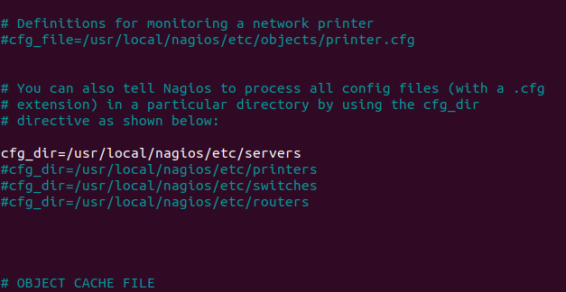

3. Ahora creamos el archivo de configuración para el cliente y añadimos los servicios que queremos monitorizar
```
~$ sudo nano /usr/local/nagios/etc/servers/server1.cfg
```

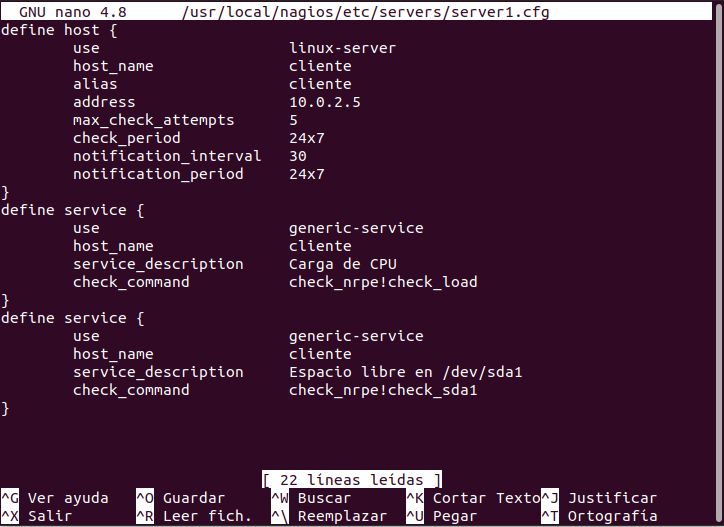
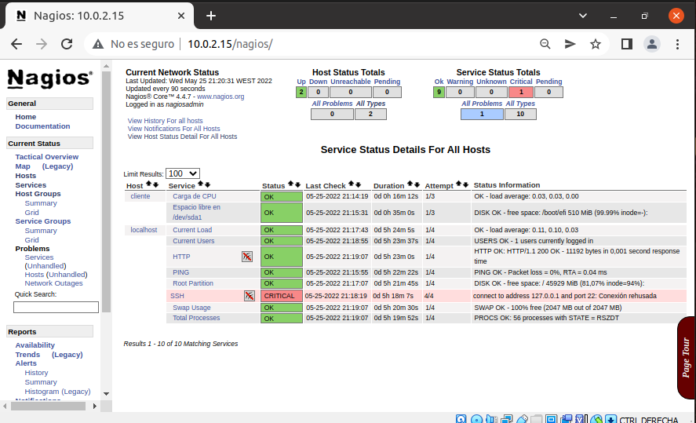

#### Monitorizar una pagina web mediante Nagios
1.	Dentro del fichero de configuración de nuestro servidor ponemos un nuevo host con la ip de la página web que queremos monitorizar y los servicios que queremos de esta pagina
```
~$ sudo nano /usr/local/nagios/etc/servers/server1.cfg
```

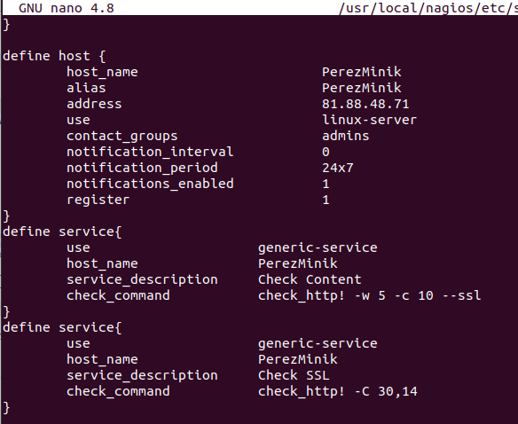
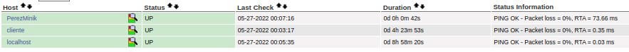
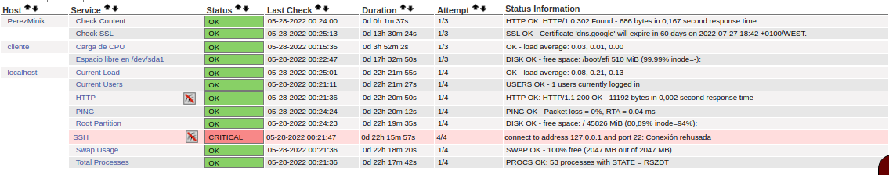
